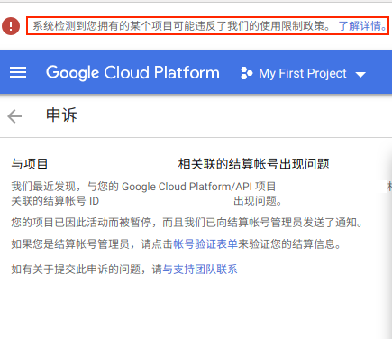

# gcp 免费试用,搭建ssr

此处不仔细讲,只附上链接,如有侵权,请联系楼主

**1**.[链接](https://www.wmsoho.com/google-cloud-platform-ssr-bbr-tutorial/)叙述:此链接有过程很全,但是自从2019年以来,gcp平台已经没有"中国"的选项了,在注册的时候很难进行下一步的选择,所以请看第二步

**2**.[视频链接](https://www.youtube.com/watch?v=oZWAP9_ciOE):此链接是youtube上的视频,此处需要能翻墙才能观看,视频里面讲解了如何去使用美国信息注册,并且使用信用卡注册(此处信用卡必须支持**多币种**,不了解的自行百度),千万不要在淘宝上租用购买,几乎无效.

**3**."您的结算帐号已暂停，需要进行帐号验证",此时首先看第一步链接的教程,如果不能解决,查看自己有几个项目,肯那个是其中一个项目存在信息错误导致的不能使用,只要删除报错的项目就可以了
例子:如图

"与项目"后面为项目的名称

**4**.创建实例的时候,选择启动磁盘系统的时候,可能不会出现类似常见的linux系统,可能是chrome os system,如果这种情况出现,重新创建一个实例,就可以看到常见的系统选项.(原实例要删除)

**5**.在选择vm实例的时候,首先选择最便宜的,用一段时间以后观看自己的费用(可能和预估的价格不符),在自行选择合适的套餐.